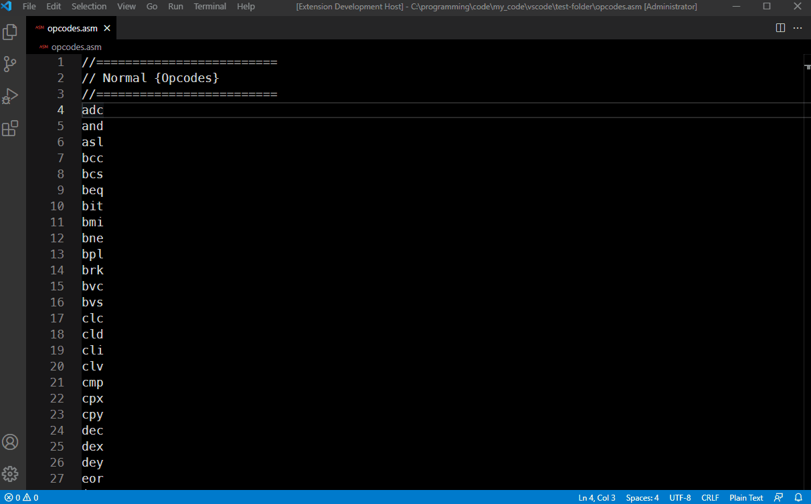

# c64opcodes

This extension for VSCode displays a Webview page with detailed information on 6502/6510 opcodes. To execute the extension run the command `Open C64 Opcodes List` from the command pallete. If the cursor is on an opcode when run, that opcodes detailed information will be displayed, otherwise the extensions menu page will load allowing you to browse the opcode lists.

Note: The opcode text does not need to be selected, simply place the cursor on the opcode then run the command

All normal and illegal opcodes are included.

## Features
- Get detailed information on any opcode.
- View flags affected by any opcode.
- Optionally display text using a C64 font.
- Code examples for select opcodes.
- Theme aware, adjusts background and text colors for dark, light, and high contrast themes.

## Screenshot

## Requirements
If you use [Kick Assembler](http://theweb.dk/KickAssembler/Main.html#frontpage)] I recommend using [Kick Assembler 8-Bit Retro Studio](https://marketplace.visualstudio.com/items?itemName=paulhocker.kick-assembler-vscode-ext) by Paul Hocker along with this extension.

## Extension Settings
`Use C64 Font` (False by default) Displays the webiew text using a Commodore 64 font.

`Use Side Panel` (True by default) Option to open the Opcode Webview in the current editor column, or in a side panel.

## Todo
- Add more detailed information on other topics such as CPU, Flags, etc.

## Release Notes
See the [Release Notes](RELEASE.md) for details.

## Acknowledgments
[C64 Kickass IDE](http://back2theretro.blogspot.com/2013/02/c64-kickass-ide-acaba-de-ser-traducido.html) written by 'Lobogris' Notably the index.chm help file. Most of the description text and the code examples were sourced from this help file.

The website by [Gregory Nacu](http://www.c64os.com/post/6502instructions) which provided the inspiration for the webview layouts.

The website [6502.org](http://6502.org/tutorials/6502opcodes.html) for reference.

Also the website [www.c64-wiki.com](https://www.c64-wiki.com/wiki/Opcode) for reference.

The C64 Font created by [Devin D. Cook](http://www.DevinCook.com) used optionally in the Webviews.

Illegal Opcode reference [6502 “Illegal” Opcodes Demystified](https://www.masswerk.at/nowgobang/2021/6502-illegal-opcodes)

Illegal Opcode reference [6502 Instruction Set](https://www.masswerk.at/6502/6502_instruction_set.html)

Illegal Opcode reference [NMOS 6510 Unintended Opcodes (No More Secrets)](http://hitmen.c02.at/files/docs/c64/NoMoreSecrets-NMOS6510UnintendedOpcodes-20162412.pdf)

**Enjoy!**
